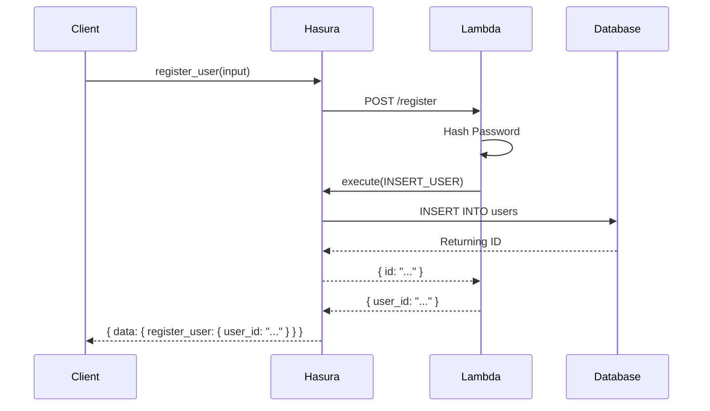
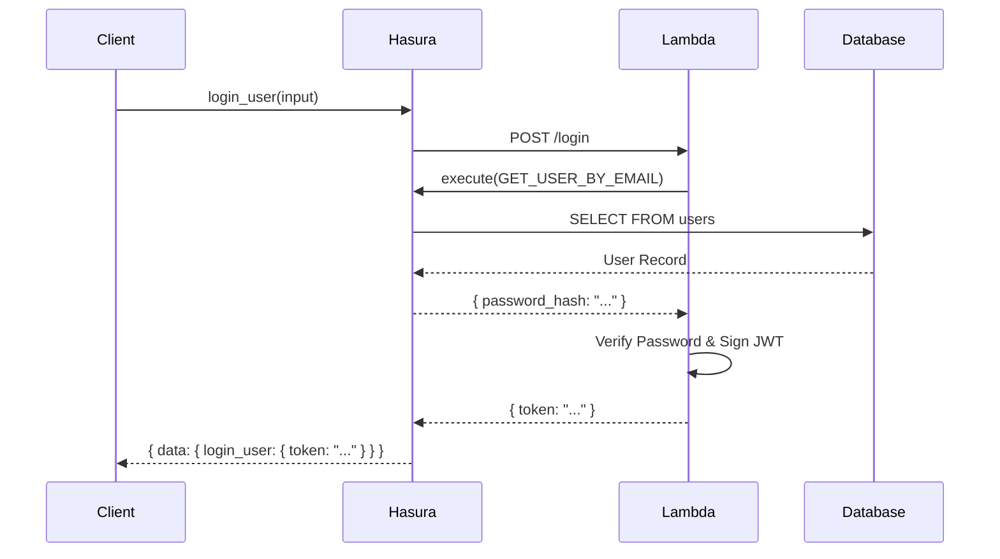
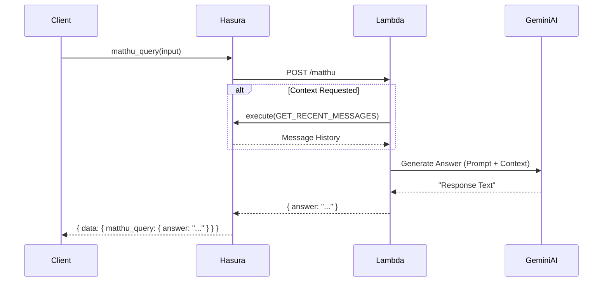
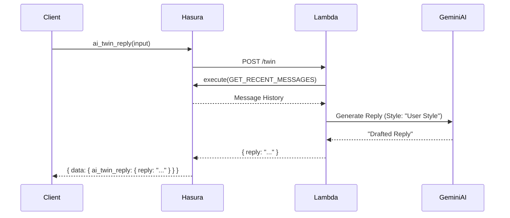
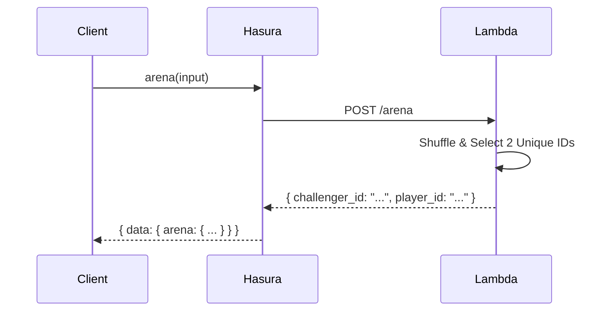
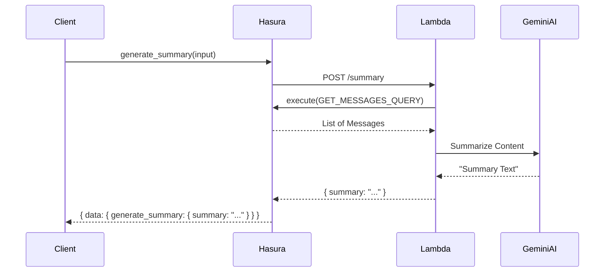
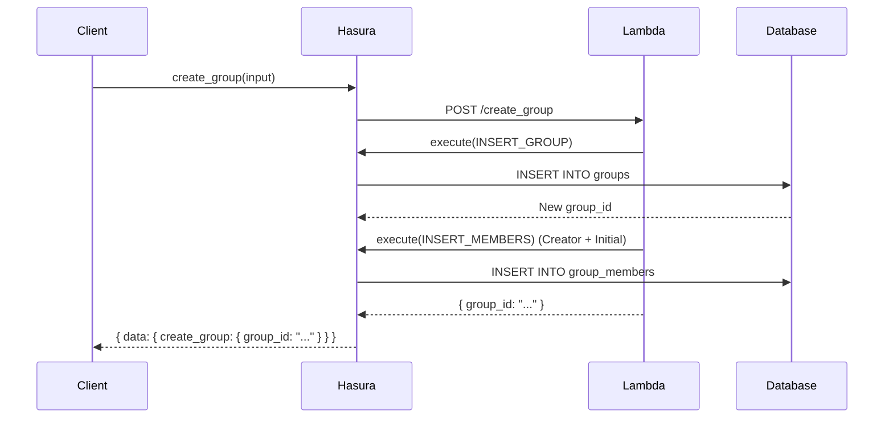
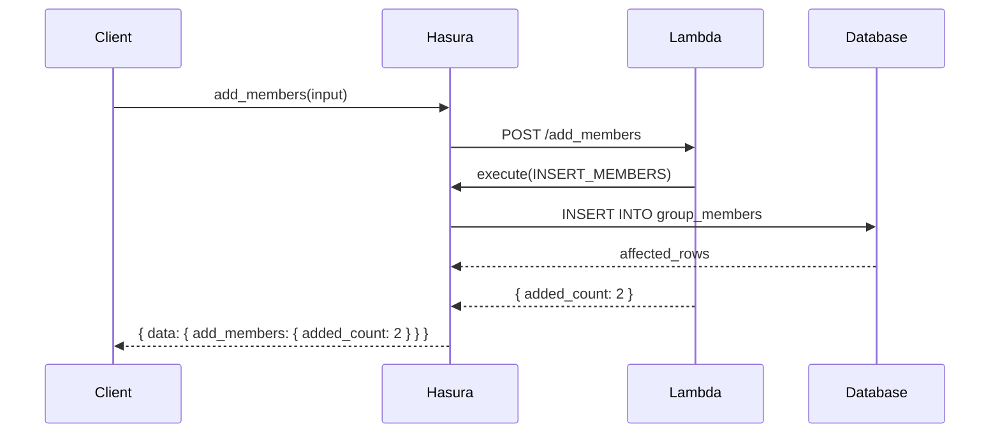
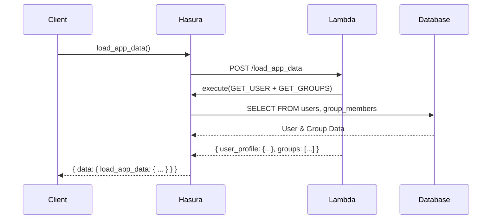

# Mathu Kathe: Backend documentation

## 1. Project Definition
**Mathu Kathe** is an Intelligent Real-Time Communication Platform. It goes beyond basic messaging by integrating advanced AI Features to enhance user experience.

**Key Features:**
*   **Real-time Messaging**: Instant communication.
*   **Mood-Aware Messaging**: Analyzes message tone.
*   **Memory Chat Groups**: Automated daily summaries.
*   **AI Twin**: Personal AI assistant for drafting replies.
*   **Interactive Utilities**: Games like Truth or Dare (Arena).
*   **AI Bot**: `@aibot` query system.
*   **Group Management**: Robust group creation and organization.

(Ref: `DOCUMENTATION_COMPLETE.md`)

## 2. Folder Structure
The project is organized as follows, highlighting the Serverless architecture:

```
ServerlessChatApp/
├── .env                    # Environment variables
├── accesAWS.md             # AWS Access instructions
├── App/                    # Main Backend Directory (Serverless Service)
│   ├── .serverless/        # Serverless deployment artifacts
│   ├── src/
│   │   ├── handlers/       # Lambda Function Handlers
│   │   │   ├── app.ts      # App Init Logic
│   │   │   ├── arena.ts    # Truth or Dare Logic
│   │   │   ├── group.ts    # Group Management Logic
│   │   │   ├── index.ts    # Handler Exports
│   │   │   ├── login.ts    # Auth Logic
│   │   │   ├── matthu.ts   # AI Query Logic
│   │   │   ├── register.ts # Auth Logic
│   │   │   ├── summary.ts  # Summary Generation
│   │   │   └── twin.ts     # AI Twin Logic
│   │   ├── models/         # Database Models (Hasura Interactions)
│   │   │   ├── group.ts
│   │   │   ├── message.ts
│   │   │   └── user.ts
│   │   ├── tests/          # Integration Tests
│   │   │   ├── testArena.ts
│   │   │   ├── testGroups.ts
│   │   │   ├── testMatthu.ts
│   │   │   ├── testTwin.ts
│   │   │   └── ...
│   │   └── utils/          # Utilities (Gemini, Hasura, Password)
│   │   │   ├── gemini.ts
│   │   │   ├── hasura.ts
│   │   │   └── password.ts
│   ├── index.ts            # Entry Point mapping handlers
│   ├── package.json        # Node Dependencies
│   ├── serverless.yml      # Serverless Framework Configuration
│   └── tsconfig.json       # TypeScript Config
└── hasura/                 # Hasura Configuration
    ├── metadata/           # Hasura Metadata (Actions, Databases, Permissions)
    └── migrations/         # Database Migrations
```

## 3. Serverless Implementation & Ports

The backend is deployed using the **Serverless Framework** on **AWS Lambda**.
*   **Service Name**: `chatapp`
*   **Region**: `ap-south-1` (AWS)
*   **Runtime**: `nodejs20.x`
*   **Base URL**: `https://7j4nkfem6j.execute-api.ap-south-1.amazonaws.com` (Dev Stage)

### Interaction Flow
For each action, Hasura acts as the gateway to the Serverless functions.

### Endpoints (Functions)

### 1. Register User
*   **Function**: `register_user`
*   **Handler**: `src/handlers/register.ts`
*   **Route**: `POST /register`
*   **Purpose**: Creates a new user with hashed password.

**Request:**
```json
{
  "input": {
    "email": "user@example.com",
    "password": "securepassword",
    "display_name": "New User"
  }
}
```

**Response:**
```json
{
  "user_id": "550e8400-e29b-41d4-a716-446655440000"
}
```

**Sequence Diagram:**


### 2. Login User
*   **Function**: `login_user`
*   **Handler**: `src/handlers/login.ts`
*   **Route**: `POST /login`
*   **Purpose**: Authenticates user and returns JWT.

**Request:**
```json
{
  "input": {
    "email": "user@example.com",
    "password": "securepassword"
  }
}
```

**Response:**
```json
{
  "token": "eyJhbGciOiJIUzI1NiIsInR5cCI6IkpXVCJ9..."
}
```

**Sequence Diagram:**


### 3. Matthu Query (@aibot)
*   **Function**: `matthu_query`
*   **Handler**: `src/handlers/matthu.ts`
*   **Route**: `POST /matthu`
*   **Purpose**: General AI Assistant. Injects recent chat context for awareness.

**Request:**
```json
{
  "input": {
    "prompt": "What did we discuss about lunch?",
    "group_id": "550e8400-e29b-41d4-a716-446655440000"
  }
}
```

**Response:**
```json
{
  "answer": "You discussed going to the pizza place nearby."
}
```

**Sequence Diagram:**


### 4. AI Twin Reply
*   **Function**: `ai_twin_reply`
*   **Handler**: `src/handlers/twin.ts`
*   **Route**: `POST /twin`
*   **Purpose**: Drafts a reply based on conversation history on behalf of a user.

**Request:**
```json
{
  "input": {
    "group_id": "550e8400-e29b-41d4-a716-446655440000"
  }
}
```

**Response:**
```json
{
  "reply": "That sounds like a great plan!"
}
```

**Sequence Diagram:**


### 5. Arena (Truth or Dare)
*   **Function**: `arena`
*   **Handler**: `src/handlers/arena.ts`
*   **Route**: `POST /arena`
*   **Purpose**: Randomly pairs two group members for a game.

**Request:**
```json
{
  "input": {
    "group_id": "550e8400-e29b-41d4-a716-446655440000",
    "members": ["uuid-1", "uuid-2", "uuid-3", "uuid-4"]
  }
}
```

**Response:**
```json
{
  "challenger_id": "uuid-3",
  "player_id": "uuid-1"
}
```

**Sequence Diagram:**


### 6. Generate Summary
*   **Function**: `generate_summary`
*   **Handler**: `src/handlers/summary.ts`
*   **Route**: `POST /summary`
*   **Purpose**: Summarizes group chat history for a date range.

**Request:**
```json
{
  "input": {
    "group_id": "550e8400-e29b-41d4-a716-446655440000",
    "from_date": "2023-10-01T00:00:00Z",
    "to_date": "2023-10-01T23:59:59Z"
  }
}
```

**Response:**
```json
{
  "summary": "- discussed project deadline\n- agreed on lunch venue"
}
```

**Sequence Diagram:**


### 7. Create Group
*   **Function**: `create_group`
*   **Handler**: `src/handlers/group.ts`
*   **Route**: `POST /create_group`
*   **Purpose**: Creates a group and adds the creator as an admin/member.

**Request:**
```json
{
  "input": {
    "name": "Weekend Trip",
    "members": ["uuid-2", "uuid-3"]
  }
}
```

**Response:**
```json
{
  "group_id": "new-group-uuid"
}
```

**Sequence Diagram:**


### 8. Add Members
*   **Function**: `add_members`
*   **Handler**: `src/handlers/group.ts`
*   **Route**: `POST /add_members`
*   **Purpose**: Batch adds users to a group.

**Request:**
```json
{
  "input": {
    "group_id": "550e8400-e29b-41d4-a716-446655440000",
    "members": ["uuid-5", "uuid-6"]
  }
}
```

**Response:**
```json
{
  "added_count": 2
}
```

**Sequence Diagram:**


### 9. Load App Data
*   **Function**: `load_app_data`
*   **Handler**: `src/handlers/app.ts`
*   **Route**: `POST /load_app_data`
*   **Purpose**: Fetches initial user profile and group list.

**Request:**
```json
{
  "input": {}
}
```

**Response:**
```json
{
  "user_profile": {
    "id": "uuid-1",
    "email": "user@example.com",
    "display_name": "John"
  },
  "groups": [
    { "id": "g-1", "name": "General", "unread_count": 0 }
  ]
}
```

**Sequence Diagram:**


## 4. Hasura Table Schemas

The database is PostgreSQL, managed via Hasura.

### `users`
| Column | Type | Notes |
| :--- | :--- | :--- |
| `id` | uuid | PK, Default: gen_random_uuid() |
| `email` | text | Unique |
| `display_name` | text | |
| `password_hash` | text | |
| `created_at` | timestamp | Default: now() |

### `groups`
| Column | Type | Notes |
| :--- | :--- | :--- |
| `id` | uuid | PK, Default: gen_random_uuid() |
| `name` | text | |
| `description` | text | Nullable |
| `created_by` | uuid | FK -> users.id |
| `created_at` | timestamp | |

### `group_members`
| Column | Type | Notes |
| :--- | :--- | :--- |
| `group_id` | uuid | PK, FK -> groups.id |
| `user_id` | uuid | PK, FK -> users.id |
| `role` | text | Default: 'member' |
| `joined_at` | timestamp | |

### `messages`
| Column | Type | Notes |
| :--- | :--- | :--- |
| `id` | uuid | PK |
| `group_id` | uuid | FK -> groups.id |
| `sender_id` | uuid | FK -> users.id |
| `content` | text | |
| `mood` | text | Nullable |
| `metadata` | jsonb | Nullable |
| `created_at` | timestamp | |

### `moods`
| Column | Type | Notes |
| :--- | :--- | :--- |
| `id` | uuid | PK |
| `user_id` | uuid | FK -> users.id |
| `mood` | text | |
| `confidence` | float | |
| `created_at` | timestamp | |

### `themes`
| Column | Type | Notes |
| :--- | :--- | :--- |
| `id` | uuid | PK |
| `user_id` | uuid | FK -> users.id |
| `name` | text | |
| `css` | text | |
| `created_at` | timestamp | |

## 5. Hasura Actions

### `register_user`
*   **Input**: `email` (String!), `password` (String!), `display_name` (String!)
*   **Output**: `user_id` (uuid!)

### `login_user`
*   **Input**: `email` (String!), `password` (String!)
*   **Output**: `token` (String!)

### `matthu_query`
*   **Input**: `prompt` (String!), `group_id` (uuid)
*   **Output**: `answer` (String!)

### `ai_twin_reply`
*   **Input**: `group_id` (uuid!)
*   **Output**: `reply` (String!)

### `arena`
*   **Input**: `group_id` (uuid!), `members` ([uuid!]!)
*   **Output**: `challenger_id` (uuid!), `player_id` (uuid!)

### `generate_summary`
*   **Input**: `group_id` (uuid!), `from_date` (String!), `to_date` (String!)
*   **Output**: `summary` (String!)

### `create_group`
*   **Input**: `name` (String!), `members` ([uuid!])
*   **Output**: `group_id` (uuid!)

### `add_members`
*   **Input**: `group_id` (uuid!), `members` ([uuid!]!)
*   **Output**: `added_count` (Int!)

### `load_app_data` (Query Action)
*   **Input**: None (Uses Session Session)
*   **Output**: `user_profile` (UserProfile!), `groups` ([GroupSummary!]!)

### Legacy/Planned Actions
*   `analyze_mood`: Input `message` -> Output `mood`, `confidence`.
*   `design_theme`: Input `description` -> Output `css`.
